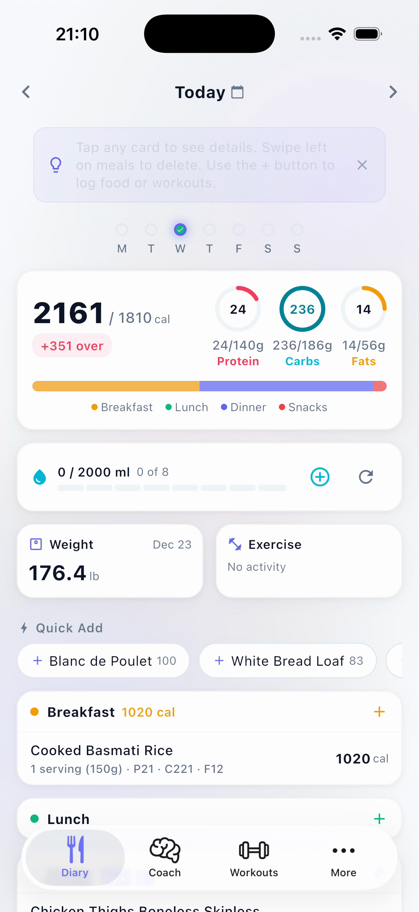
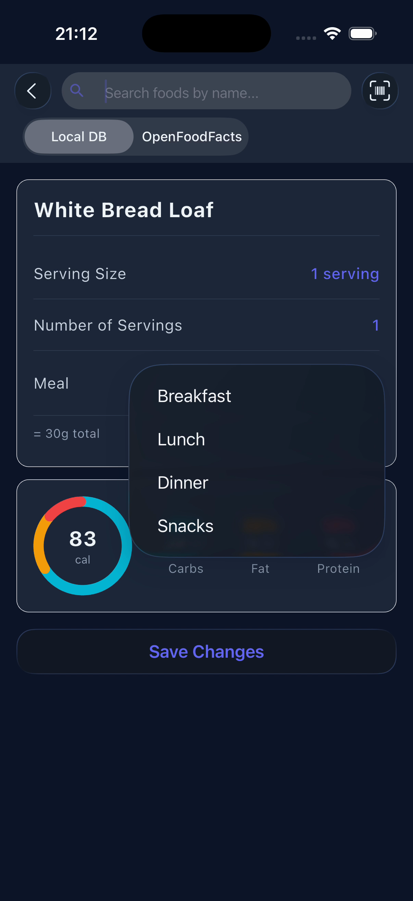
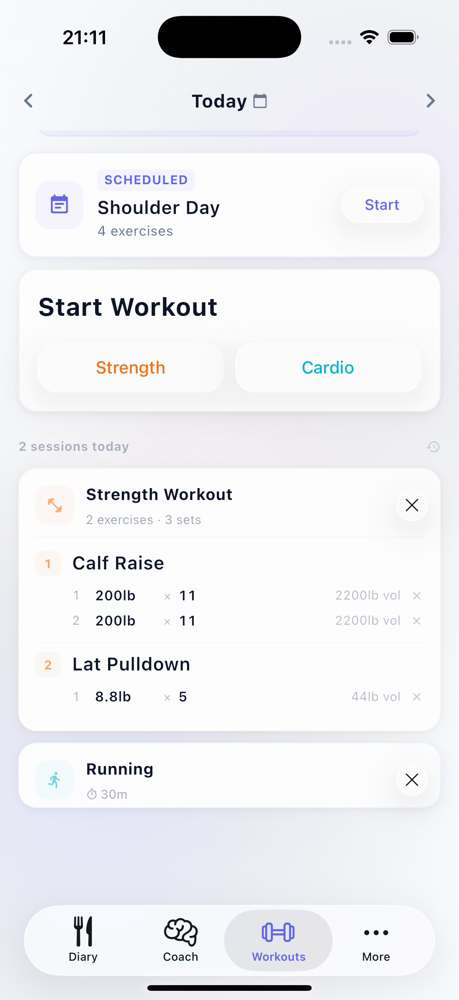
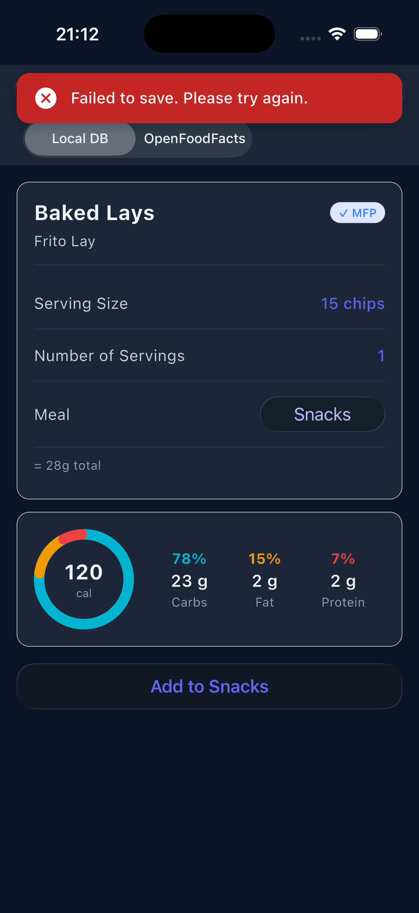
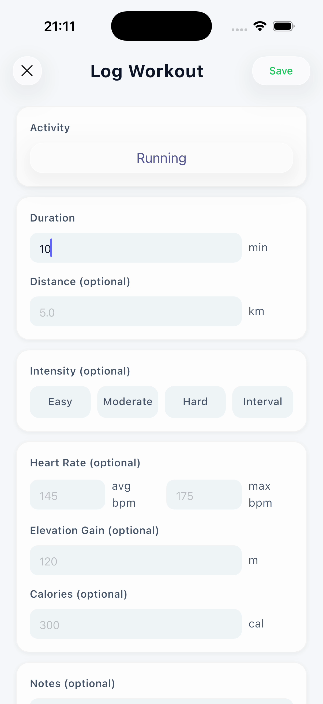
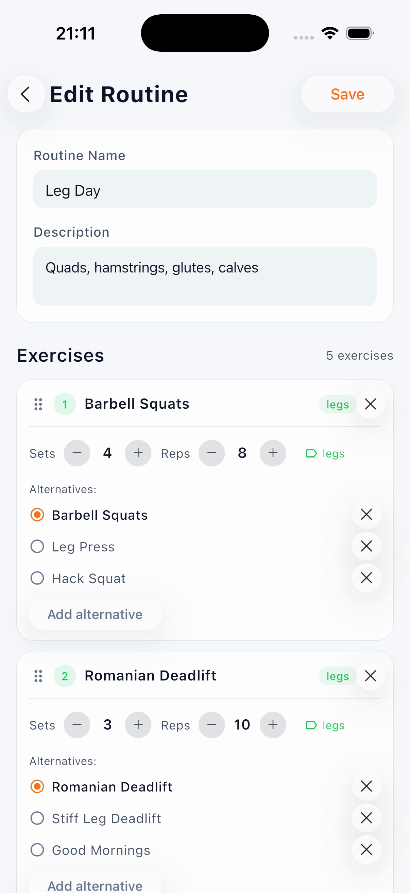
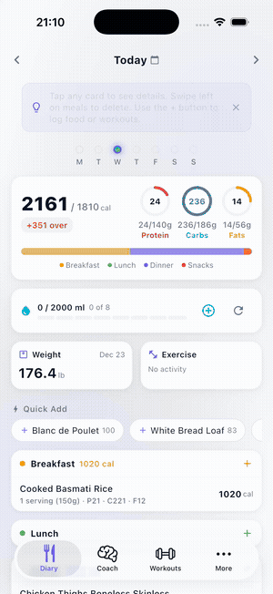

# Fitness Tracker

A full-featured fitness app built with Flutter and FastAPI. Track meals, log workouts, set nutrition goals, and get AI-powered coaching — all in one clean interface.

Built with iOS 26 Liquid Glass design language.

## Features

- **Meal Tracking** — Search 2M+ foods via OpenFoodFacts, barcode scanner, custom meals, macro breakdown
- **Workout Logging** — Strength (sets/reps/weight) and cardio (distance/duration/pace) with exercise history
- **AI Coach** — Chat with a context-aware coach that knows your diet, workouts, and goals (BYOK — bring your own OpenAI key)
- **Nutrition Dashboard** — Daily/weekly calorie and macro charts, goal tracking
- **Workout Plans** — Create weekly plans with routines, auto-suggest today's workout
- **Measurements** — Track weight, body fat, and custom measurements over time
- **Water Tracking** — Visual glass-based hydration tracker
- **iOS 26 Glass UI** — Native Liquid Glass buttons, tab bar, and alerts via `adaptive_platform_ui`
- **Dark/Light/System Themes** — Smooth animated theme switching
- **Offline Support** — Queues failed requests and replays when back online

## Screenshots

<p align="center">
  
  
  
  
</p>
<p align="center">
  
  
</p>

### Demo

<p align="center">
  
</p>

## Architecture

```
fitness_flutter/          Flutter app (iOS/Android)
├── lib/
│   ├── config/           Theme, router, API config, offline queue
│   ├── models/           Data models (Workout, MealEntry, Profile, etc.)
│   ├── providers/        Riverpod state management
│   ├── screens/          Feature screens (diary, workouts, coach, etc.)
│   ├── services/         API service layer
│   ├── utils/            Modal utilities, date/weight helpers
│   └── widgets/          Reusable components (AppCard, DateNavigator, etc.)
│
backend/                  FastAPI backend (Python)
├── routers/              API endpoints (meals, workouts, coach, auth, etc.)
├── models.py             SQLAlchemy database models
├── ai_providers.py       OpenAI integration for coach
└── main.py               App entry point
```

## Tech Stack

| Layer | Tech |
|-------|------|
| Frontend | Flutter 3.41, Dart 3.11 |
| State Management | Riverpod |
| Navigation | GoRouter |
| UI Components | adaptive_platform_ui (iOS 26 Liquid Glass) |
| Charts | fl_chart |
| Backend | FastAPI (Python) |
| Database | SQLite (via SQLAlchemy) |
| AI | OpenAI API (GPT-4) |
| Food Data | OpenFoodFacts API |

## Getting Started

### Prerequisites

- Flutter SDK ≥ 3.41
- Python ≥ 3.10
- iOS 26+ simulator or device (for Liquid Glass UI)

### Run the Flutter App

```bash
cd fitness_flutter
flutter pub get
flutter run
```

### Run the Backend

```bash
cd backend
python3 -m venv .venv
source .venv/bin/activate
pip install -r requirements.txt
cp ../.env.example .env    # Edit with your API keys
uvicorn main:app --reload --port 8000
```

### Environment Variables

Copy `.env.example` to `.env` and configure:

| Variable | Description | Required |
|----------|-------------|----------|
| `USDA_API_KEY` | USDA FoodData Central API key | Optional (has DEMO_KEY) |
| `FERNET_KEY` | Encryption key for stored AI keys | Auto-generated if empty |
| `ALLOWED_ORIGINS` | CORS origins | Default: localhost |
| `DATABASE_URL` | Database connection string | Default: SQLite |

### Local Food Database

Food search uses a large local SQLite database ('backend/<db-name>.db', `1.6 GB) for fast search and serving size data. **It is not included in this repo.**

The database is personally compiled, enriched dataset of generic and branded foods (over 1M items) with macros, micros, and real-world serving sizes, assembled from multiple "well-known" sources. it is much richer than the USDA and Openfoodfacts.

- **Without it:** the backend still runs and falls back to the USDA FoodData Central API (set `USDA_API_KEY` in `.env`).
- **With it:** place the file at the location and the backend detects it auto on startup.

**To Request the database**, open issue titles `Food DB Request` and include:
1. name(optional) and how you plan to use it
2. confirmation that your use is non-commercial and complies with the [LICENSE]

## Project Structure

The app follows a clean layered architecture:

- **Screens** — UI layer, one folder per feature
- **Providers** — Riverpod providers for async state management
- **Services** — API communication layer (static methods)
- **Models** — Typed data classes with JSON serialization
- **Config** — App-wide configuration (theme, routing, API)
- **Widgets** — Shared reusable components

## Key Design Decisions

- **iOS 26 native rendering** — Glass buttons render as native `UiKitView` platform views for authentic appearance, with automatic Flutter fallback during page transitions to prevent compositor bleed-through
- **Offline-first queue** — Failed POST/PUT/DELETE requests are queued to SharedPreferences and replayed when connectivity returns
- **Streaming AI responses** — Coach chat uses SSE streaming for real-time token display with 15fps throttled UI updates
- **Dual serving system** — Food items support both gram-based and named servings (e.g., "1 cup", "1 slice") with proper macro scaling

## Contributing

Contributions are welcome! Please:

1. Fork the repository
2. Create a feature branch (`git checkout -b feature/my-feature`)
3. Commit your changes
4. Push to the branch
5. Open a Pull Request

See [CHANGELOG.md](CHANGELOG.md) for development history.

## License

MIT License — see [LICENSE](LICENSE) for details.
